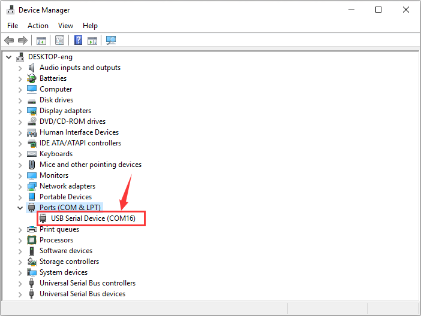

# FAQ

## micro:bit驱动安装说明:

下面给micro:bit开发板安装驱动。首先将micro:bit开发板用micro USB数据线连接到电脑上，然后鼠标左键双击驱动文件，点击Install。


点击“Next”继续安装驱动。


先点击“Install”，再点击“Finish”，安装完成。


安装完成后，鼠标右键单击“我的电脑” —\>左键单击“属性”—\>左键单击“设备管理器”,可以看到下图。




## 更新您的micro：bit固件

什么是micro：bit固件?

固件是使设备正常运行的一种特殊软件。您可以将其视为使机器按其行为方式运行的软件。

micro：bit的背面有两个芯片。其中一个运行您的代码，而另一个运行固件以使您能够对设备进行编程。

micro：bit可以与随附的固件一起使用，因此，如果您不需要对其进行更新，请回到我们的micro：bit功能指南。

有时您可能需要更新固件以测试新的软件功能。如果是这种情况，此页面将向您显示操作方法。

如何找出当前的固件版本

升级之前，您需要找出micro：bit上的固件版本。通过micro USB线将其插入，从MICROBIT驱动器中打开DETAILS.TXT文件，并在以“接口版本”开头的行上查找编号。

```
##DAPLink Firmware - see https://mbed.com/daplink Unique ID: 9900000031634e4500624014000000320000000097969901
HIC ID: 97969901
Auto Reset: 1
Automation allowed: 0
Overflow detection: 0
Daplink Mode: Interface
Interface Version: 0250
Git SHA: 682d8303e37355532402b8d93c4f240a3cec02a9
Local Mods: 0
USB Interfaces: MSD, CDC, HID, WebUSB
Interface CRC: 0x3f2b7e12
Remount count: 0URL: https://microbit.org/device/?id=9900&v=0250
```

如何更新固件

1.从此页面将十六进制文件下载到您的电脑。

下载最新的micro:bit固件-0253的链接：[https://cdn.sanity.io/files/ajwvhvgo/production/5ecfa4d407a9d02e0f2e7fe192e5fa6a246f8621.hex?dl=0253_kl26z_microbit_0x8000.hex](https://cdn.sanity.io/files/ajwvhvgo/production/5ecfa4d407a9d02e0f2e7fe192e5fa6a246f8621.hex?dl=0253_kl26z_microbit_0x8000.hex )

（注意：你可以点击上述链接下载最新固件-0253十六进制文件；如果你不下载，在相应的文件夹中也有我们事前下载好的最新固件-0253十六进制文件）

2.然后，在卸下电池组并将micro USB线连接到电脑的情况下，按住micro：bit背面的重置按钮，

然后将micro USB线插入设备。您应该看到一个名为MAINTENANCE的驱动器出现在文件管理器中。


3.将您从该页面下载的.HEX拖放到micro：bit上，然后等待设备背面的黄色系统LED停止闪烁。升级完成后，micro：bit将重置，从计算机中弹出并以正常MICROBIT驱动器模式重新出现。

4.最后，检查MICROBIT驱动器上的DETAILS.TXT文件，并确保它具有与您刚下载并刷新到接口芯片的.HEX固件相同的版本号。

先前的固件版本

如果出于任何原因希望用回原理的固件，可以下载以前的版本


## 用Web USB排除下载过程中的故障

Micro：bit与WebUSB（/device/usb/webusb）配对时遇到问题？让我们尝试找出原因。

Step 1: 检查你的线

确保使用micro USB线将micro：bit连接到电脑。连接后，您应该会在Windows资源管理器中看到一个MICROBIT 驱动器。


如果可以看到MICROBIT驱动器，请转到步骤2。如果看不到该驱动器，请执行以下操作：

● 确保micro USB线正常工作。

micro USB线是否在另一台电脑上工作？如果不是，请查找其他micro USB线。某些micro USB线可能仅提供电源连接，实际上并未传输数据。

● 在电脑上尝试另一个USB端口。

电缆是否正常，但是您仍然看不到MICROBIT 驱动器？嗯，您的micro：bit可能有问题。尝试在microbit.org上的故障查找页面中（[https://support.microbit.org/support/solutions/articles/19000024000-fault-finding-with-a-micro-bit](https://support.microbit.org/support/solutions/articles/19000024000-fault-finding-with-a-micro-bit)）描述的其他步骤。如果这样做没有帮助，您可以创建支持通知单（[https://support.microbit.org/support/tickets/new](https://support.microbit.org/support/tickets/new)）将问题通知Micro：bit基金会。跳过其余步骤。

Step 2: 检查您的固件版本

micro：bit上的固件版本可能需要更新。 让我们检查：

1.找到MICROBIT 驱动

2.打开DETAILS.TXT 文件


在文件中查找说明版本号的行。 Version: ...


或接口Version: ...


如果版本为0234、0241、0243，则需要更新固件（/设备/固件）在您的micro：bit

上。 转到步骤3，然后按照升级说明进行操作。

如果版本是0249、0250或更高版本，则您具有正确的固件，请转到步骤4。

Step 3: 升级固件

1.将您的micro：bit进入维护模式。 为此，请从micro：bit拔下micro USB线，

然后在按住复位按钮的同时重新连接micro USB线。 插入micro USB线后，可以释放复位按钮。现在，您应该像以前一样看到一个MAINTENANCE驱动器，而不是MICROBIT驱动器。同样，黄色的LED指示灯将在重置按钮旁边保持点亮。


2.下载 firmware .hex file

([https://microbit.org/guide/firmware/](https://microbit.org/guide/firmware/))

3.将该文件拖放到 MAINTENANCE驱动器上。

4 复制HEX文件时，黄色LED指示灯将闪烁。 复制完成后，LED会熄灭，并且

micro：bit会重置。 现在，MAINTENANCE驱动器会变回MICROBIT。

5.升级完成！
您可以打开DETAILS.TXT 文件进行检查并查看固件版本已更改为与您复制的HEX文件的版本相匹配。

如果您想了解有关连接板，维护模式和升级固件的更多信息，请在固件指南请在固件指南（<https://microbit.org/guide/firmware/>）中进行阅读。

Step 4: 检查您的浏览器版本

WebUSB是一项相当新的功能，可能需要您更新浏览器。 检查您的浏览器版本是否

符合以下条件之一：

● 适用于Android，Chrome操作系统，Linux，macOS和Windows 10的Chrome 65+。

Step 5: 配对装置

更新固件后，打开Chrome浏览器，转到编辑器，然后点击齿轮菜单中的“配对设备”。有关配对说明，请参见WebUSB（/device/usb/webusb），对应的链接：[https://microbit.org/get-started/user-guide/web-usb/](https://microbit.org/get-started/user-guide/web-usb/)。

享受快速下载！


