Microbit V2.0传感器学习套装

# 产品简介

（1）Micro:bit是什么?

Micro:bit主板是英国广播公司设计的，旨在帮助7年级（11-12岁）及以上的孩子更好地学习编程。Micro:bit主板拥有丰富的板资源，包括一个5\*5 LED点阵、2个可编程按钮、指南针、Micro USB端口、蓝牙模块等。它只有信用卡一半大小(4cm×5cm)，但功能非常强大。它可以用于编写电子游戏，声光互动，机器人控制，科学实验，可穿戴装置开发等，可以实现任何酷炫的小发明，无论是机器人还是乐器，没有做不到只有想不到。

新款的Micro:bit V2主板上有一个可触摸感应的Logo和MEMS麦克风。背面还添加了一个蜂鸣器，这样就可以在没有外部设备的情况下播放各种声音。底部的金手指加上齿轮设计，方便用户更好地固定鳄鱼夹。此外，Micro:bit V2主板还支持休眠模式，用户可以长按Micro:bit V2主板后面的复位&电源按钮，使其进入睡眠模式，降低电池功耗。最重要的特点是Micro:bit V2主板的CPU性能比V1.5版本好得多，外加更多的RAM。所以Micro:bit V2允许用户扩展更多的功能，创造更多的创意作品。

为了方便学习micro bit单片机和一些基础电子知识，我们特别配置了这个传感器套件。套件主要包含一个micro bit控制板，一些常用的传感器和模块。使用时我们给扩展板供电DC7-9V，扩展板既可以给Micro bit板供电，又可以给传感器模块供电。在我们使扩展板时，我们可以通过连接跳线帽，控制给传感器供电接口V1和V2的电压（DC 3.3V和DC 5V）。我们还会根据这些传感器模块，提供搭配micro bit板使用的学习课程，课程包含接线方法，测试代码等。

（2）Micro:bit主板硬件分布图介绍：

Micro:bit V2主板

Micro:bit V1.5主板

Micro:bit V2主板与Micro:bit V1.5主板的比较：

在新款Micro:bit V2主板上按下复位&电源按钮将重置micro:bit并重新运行程序。如果你按住它，红色的LED就会慢慢褪色。当电源指示灯变暗时，松开按钮，你的micro:bit主板就会进入省电睡眠模式。通过这种方法可以让你的电池用的更持久，再次按下此按钮可以来唤醒你的Micro:bit。

有关更多内容，请参阅：[https://tech.microbit.org/hardware/](https://tech.microbit.org/hardware/)

<https://microbit.org/new-microbit/>

[https://www.microbit.org/get-started/user-guide/overview/](https://www.microbit.org/get-started/user-guide/overview/)

[https://microbit.org/get-started/user-guide/features-in-depth/](https://microbit.org/get-started/user-guide/features-in-depth/)

（3）Micro:bit引脚配置介绍，如下图所示：

Micro:bit V2主板 Micro:bit V1.5主板

详细信息请参考官方网站：[https://tech.microbit.org/hardware/edgeconnector/](https://tech.microbit.org/hardware/edgeconnector/)

<https://microbit.org/guide/hardware/pins/>

（4）新款Micro:bit V2主板使用注意事项：

- a\. Micro:bit   V2主板上有很多精密的电子元件，建议戴上硅胶保护套进行使用，防止短路。

- b\. Micro:bit   V2主板的IO口驱动能力很弱，IO口电流不足300mA，请勿接大电流器件（例如大舵机MG995、直流电机），否则会烧坏Micro:bit   V2主板，使用前必须完全了解清楚你所使用的器件电流情况，一般建议配搭Micro:bit扩展板进行使用。

- c\. 供电建议从Micro:bit V2主板的USB口进行供电，或者Micro:bit   V2主板上的3V电池座接口。Micro:bit   V2主板本身IO口是3V电平，所以是不支持5V传感器的，如需支持5V传感器需要使用
  Micro:bit扩展板。

- d\. 使用与Micro:bit   V2主板LED点阵的共用引脚（如P3、P4、P6、P7、P10），记得在代码中把LED点阵禁用掉，否则会有LED点阵显示杂乱和可能让所接传感器数据出错的现象。

- e\. 3V电池座接口上不能使用超过3.3V电池，否则很容易会把Micro:bit   V2主板烧坏。

- f\. 禁止放在金属制品上使用，以免发生短路。

总结：Micro:bit V2主板就像是一台微型计算机，它使编程变得有形，并促进数字创造力。关于编程环境，BBC提供了一个在线编程网站：<https://microbit.org/code/>，该网站有一个易于使用的图形化程序MakeCode。

# 产品清单

|编码|规格型号|数量|图片|
|-|-|-|-|
|1|keyes micro bit 传感器V2扩展板|1||
|2|Keyes 薄膜压力传感器|1||
|3|keyes 巡线传感器|1||
|4|keyes 震动模块传感器|1||
|5|keyes 水滴水蒸气传感器|1||
|6|keyes TEMT6000光线传感器|1||
|7|keyes 光敏电阻传感器|1||
|8|keyes 麦克风声音传感器|1||
|9|keyes 有源蜂鸣器模块|1||
|10|keyes GUVA-S12SD 3528 紫外线传感器|1|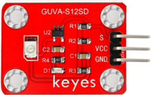|
|11|keyes 无源蜂鸣器模块|1||
|12|keyes 插件RGB模块|1||
|13|keyes 霍尔传感器|1|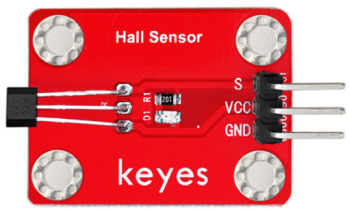|
|14|keyes 电容触摸传感器|1||
|15|keyes MQ-2 烟雾传感器|1||
|16|keyes 水位传感器|1||
|17|keyes LM35温度传感器|1||
|18|keyes 食人鱼LED白光模块|1||
|19|Keyes 红绿灯模块|1||
|20|keyes 干簧管模块|1||
|21|keyes 土壤传感器|1||
|22|keyes 光折断传感器|1||
|23|keyes 碰撞传感器|1||
|24|keyes 避障传感器|1||
|25|keyes 草帽LED白发白模块|1|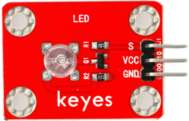|
|26|keyes 3W LED模块|1||
|27|keyes DHT11温湿度传感器|1||
|28|keyes 摇杆模块传感器|1||
|29|keyes MQ-3 酒精传感器|1||
|30|keyes 倾斜模块传感器|1|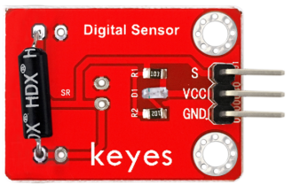|
|31|keyes 5V 单路继电器模块|1||
|32|keyes 火焰传感器|1||
|33|keyes 按键传感器|1||
|34|keyes 人体红外热释电传感器|1||
|35|keyes 可调电位器模块|1||
|36|HC-SR04超声波模块|1||
|37|1602 I2C 蓝屏 LCD|1|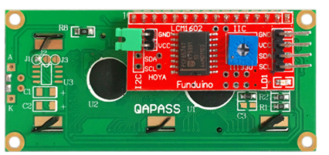|
|38|SG90 9G 23*12.2*29mm 蓝色 辉盛 90度 舵机|1||
|39|母对母 杜邦线20CM/40P/2.54/10股铜包铝 24号线|1||

# Micro:bit驱动安装说明

如果你已经安装过micro:bit
驱动，就不需要再次安装micro:bit驱动。假如你是首次使用micro:bit主板，则你的电脑需要安装micro:bit驱动，我们提供的micro:bit驱动文件和micro:bit驱动安装手册都在文件夹“Micro:bit
驱动程序下载安装”里面，你可以进入相关文件夹中根据micro:bit驱动安装手册中的说明来安装micro:bit驱动。

→

# 代码与编程

以下的步骤说明基于Windows
操作系统，如果你使用的是其他操作系统，可以将其作为参考。

## 1快速开始

本节介绍如何为micro:bit编写程序以及如何将其下载到micro:bit V2主板。micro:bit官方网站上有非常详细的教程，你可以参考：[https://microbit.org/guide/quick/](https://microbit.org/guide/quick/)

### Step 1: 连接Micro:bit V2主板

通过Micro USB线将micro:bit V2主板连接到电脑，（[使用移动动设备对micro:bit进行编码，请移步查看](https://microbit.org/guide/mobile/)：[https://microbit.org/get-started/user-guide/mobile/](https://microbit.org/get-started/user-guide/mobile/)）
Macs、PCs、 Chromebooks and Linux系统（包括Raspberry Pi）都支持micro:bit V2主板。

新款micro:bit V2主板背后的红色LED会显示，表明micro:bit V2主板有电了。

Micro:bit V2主板将在你的电脑上显示为一个名为'MICROBIT'的驱动器。但请注意，它不是普通的USB磁盘！如下图：

### Step 2: 编写程序： 

在浏览器中访问链接：[https://makecode.microbit.org/](https://makecode.microbit.org/)，然后单击“新建项目”，出现“创建项目”对话框，在对话框中输入“heartbeat”，单击“创建
√”并开始编程。

如果你的电脑具有Windows 10操作系统，则还可以使用Windows 10 App进行编程，这与在浏览器上进行编程完全相同:
[https://www.microsoft.com/zh-cn/p/makecode-for-micro-bit/9pjc7sv48lcx?ocid=badgep&rtc=1&activetab=pivot:overviewtab](https://www.microsoft.com/zh-cn/p/makecode-for-micro-bit/9pjc7sv48lcx?ocid=badgep&rtc=1)

（以下是以Google Chrome为例，其他浏览器类似）

编写一个micro:bit代码。
例如，从模块区拖放一些指令方块放入代码编辑区，然后在MakeCode编辑器中的Simulator上运行你的程序，如下图（和视频）所示，该图（和视频）显示了如何对heartbeat进行编程。如何导入示例代码，请查看后面4.5章节。

下一节将进一步介绍Makecode。

### Step 3: 下载代码：

如果使用Windows 10 App编写程序，则只需单击“下载”按钮，该代码程序将直接下载到micro:bit V2主板，而无需任何其他操作。

如果使用浏览器编写程序，请按照以下步骤操作：

单击编辑器中的“下载”按钮。
这将下载一个“hex”文件，该文件是micro:bit主板可以读取的紧凑程序格式。十六进制文件下载后，将其复制到你的micro:bit V2主板，就像将文件复制到USB驱动器一样。
在Windows上，你还可以右键单击并选择“发送到→MICROBIT（E）”将“hex”文件拷贝到micro:bit V2主板。

也可以将“hex”文件直接拖入MICROBIT（E）磁盘中。

将下载好的“hex”文件拷贝到micro:bit V2主板过程中，micro:bit V2主板背面的黄色信号灯会闪烁，当拷贝完成后黄色信号灯停止闪烁，保持长亮。

### Step 4: 运行程序： 

代码程序上传micro: bit V2主板后，通过micro USB线或外接电源供电给micro:
bit V2主板供电，micro: bit V2主板上5 x 5 LED点阵显示heartbeat的图案。

micro USB线供电 外接电源供电（3V）

Step5：掌握：  
本小节向你展示了如何开始使用micro:bit V2主板，但是除了MakeCode图形化编程之外，你还可以使用其他语言来编写micro:bit的程序代码。转到链接：[https://microbit.org/code/](https://microbit.org/code/)查看不同的语言编程，或查看链接：[https://microbit.org/projects/](https://microbit.org/projects/)，了解你可能想要尝试的一些内容。

## 2.Makecode：

在Google Chrome访问链接：<https://makecode.microbit.org/>，打开makecode在线版本。或打开
Windows 10 App makecode版本。

点击 “New Project”,出现“创建项目”对话框，在对话框中输入“heartbeat”，单击“创建
√”进入Makecode 编译器，Makecode 编译器如下:

设置

“+”放大，“-”缩小。

恢复撤销

撤销

保存项目

项目名称

代码下载按钮

模块

图形代码和文本代码开关

代码编辑区

Simulator

在代码编辑区中，有两个固定的指令方块“on start”和“forever”。

上电或复位后，“on start”指令方块中的代码将仅执行一次；并且“forever”指令方块中的代码将循环执行。

## 3.快速下载：

如前所述，如果使用makecode的Windows 10 App，则可以通过单击“下载”按钮将代码快速下载到micro:bit V2主板。

使用makecode的浏览器版本可能需要更多步骤。但是，如果你将Google Chrome用于Linux，macOS和Windows 10系统，则也可以实现快速下载功能。

在这里，我们使用Chrome的webUSB功能，该功能允许网页访问你的micro USB硬件设备。 我们将按照以下步骤完成micro:bit设备与网连接和配对。

配对装置：

用micro USB线连接电脑和micro:bit V2主板。

单击“下载”右边的“...”，然后单击“设备配对”。

然后继续单击“设备配对”按钮。

在弹出窗口中选中对应的“设备”，然后单击“连接”按钮。
如果弹出窗口中没有设备，请参考以下内容：[https://makecode.microbit.org/device/usb/webusb/troubleshoot](https://makecode.microbit.org/device/usb/webusb/troubleshoot)

当然，如果你不想点击链接进入相关页面中查看，你也可以在本教程的文件夹中直接阅读“用WebUSB排除下载过程中的故障.pdf”。

如果你的micro:bit V2主板出现问题是需要更新micro:bit的固件，在本教程的文件夹“如何更新Micro:bit V2主板的固件”中的文件“如何更新micro:bit V2主板的固件.pdf”介绍了如何更新micro:bit的固件，其内容来自：[https://microbit.org/guide/firmware/](https://microbit.org/guide/firmware/)

连接成功后，单击“下载”按钮，程序将直接下载到Micro: bit V2主板，同时还会出现“Download completed!”提示语。

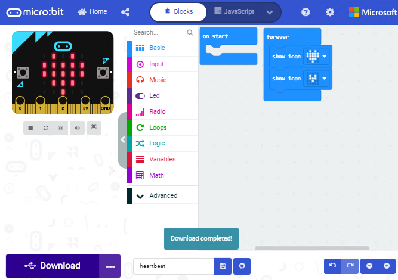

## 4.资源和代码

购买后，我们业务会提供一个相关产品的资料链接。资料中主要包含相关工具、测试代码、教程和故障处理方法等，如下图。

## 5.导入代码

我们为每个项目提供十六进制代码文件（项目文件）。十六进制代码文件包含项目的所有内容，可以直接导入，你也可以手动拖动代码块来完成每个项目的代码程序。对于简单项目，建议通过拖动代码块来完成项目。
对于复杂的项目，建议通过导入我们提供的十六进制代码文件来完成项目.

接下来，我们以“ Heatbeat”项目为例，介绍如何加载代码。

打开Web版本的makecode或Windows10 APP版本的makecode。

在弹出的对话框中，单击“导入文件”。

选择文件“ ../Makecode Code/Project 1\_ Heart beat/Project 1\_ Heart beat.hex”。 然后点击“继续！”

除了上述将提供的项目代码程序文件直接导入到Makecode
编译器中的方法之外，也可以将我们提供的项目代码程序文件直接拖入到Makecode编译器中的代码编辑区，如下图所示：

几秒钟后，项目成功加载。

注意：如果你的电脑系统是Windows7/8而不是Windows 10，则在Google Chrome中是无法进行设备配对，从而无法直接在串口模拟器上输出一些传感器/模块的数字信号或模拟信号，可是又需要读取相应的传感器/模块的数字信号或模拟信号，那怎么办呢？这里就可以使用CoolTerm软件来读取microbit的串口数据，下面是CoolTerm安装方法。

## 6.CoolTerm软件安装方法

这里需要安装CoolTerm程序软件，CoolTerm程序软件是用来在下面的一些实验中读取串口通讯的，这里我们提供了CoolTerm程序软件的下载链接：<https://freeware.the-meiers.org/>

1.  现在，让我们来安装CoolTerm程序软件，这里我们是以PC     Window系统为例，选择下载安装CoolTerm     Win，下载后解压并打开。（Mac系统和 Linux系统也类似）

（2）左键双击程序文件。（注意：必须保证micro:bit驱动已安装和micro:bit V2主板连接到电脑上）

下面列出了工具栏上每个按钮的功能：

||Opens up a new Terminal|
|-|-|
||Opens a saved Connection|
||Saves the current Connection to disk|
||Opens the Serial Connection|
||Closes the Serial Connection|
||Clears the Received Data|
||Opens the Connection Options Dialog|
||Displays the Terminal Data in Hexadecimal Format|
||Displays the Help Window|

# 详细课程

## 实验1: 闪烁的心

1.实验介绍:

这个项目很简单，你可以用一个micro:bit V2主板、一根Micro USB线和电脑就可以实现的，首先在micro:bit LED点阵上显示一个大的“❤”，然后显示小的“❤”，这个循环看起来就像心跳。这也是一个入门实验，让你进入micro:bit的编程世界。

2.所需组件:

- Micro:bit V2主板\*1

- Micro USB 线\*1

3.实验接线:

通过micro USB线将micro:bit V2主板连接到你的电脑上。

4.示例代码:

如果你不熟悉编码，别担心。首先，你可以输入这个链接:
[https://makecode.micro:bit.org/reference](https://makecode.microbit.org/reference)
来了解更多关于 micro: bit blocks
的信息。然后你可以直接进入链接：[https://makecode.micro:bit.org/](https://makecode.microbit.org/)
编辑你的项目程序代码。

5.实验现象:

按照之前的方式将代码下载到micro:bit V2主板，micro USB数据线不要拔下来，利用micro USB数据线上电，micro:bit主板上的LED点阵屏切换显示“❤”图案和“”图案，循环进行。

(如何下载代码？如何快速下载代码？请参考4.3章节)

如果存在下载问题，请断开micro USB线和Micro:bit V2主板连接，然后重新连接它们并重新打开Makecode，以尝试再次下载。

## 实验2: 单个LED闪烁

1.  实验介绍:

在这个项目中，我们尝试控制micro:bit V2主板上的LED点阵中的某个LED闪烁效果。

2.所需组件:

- Micro:bit V2主板\*1

- Micro USB 线\*1

3.实验接线:

通过micro USB线将micro:bit V2主板连接到你的电脑上。

4.元件介绍：

Micro:bit V2主板的LED点阵共由25个发光二极管组成，5个一组，分别对应X和Y方向，形成一个5×5的矩阵，且每个发光二极管是放置在行线（X）和列线（Y）的交叉点上，我们可以通过设置坐标点来实现对25个LED中某一个LED的控制。例如，想要LED点阵中第1行第1个LED点亮，可以设置坐标点为（0，0）；第1行第3个LED点亮，可以设置坐标点为（2，0）；第1列第5个LED点亮，可以设置坐标点为（0，4）；第3列第2个LED点亮，可以设置坐标点为（2，1），依此类推。

5.示例代码:

6.实验现象:

按照之前的方式将代码下载到micro:bit V2主板，利用micro USB数据线上电，可以看到坐标点(1,0)的LED的闪烁，持续1s，接着切换到坐标点(3,4)的LED闪烁，持续1s。循环进行。

## 实验3: LED点阵显示

1.实验介绍:

点阵在我们生活中很常见，很多都有用到它，比如LED广告显示屏，电梯显示楼层，公交车报站等等。

Micro:bit V2主板的LED点阵共由25个发光二极管组成，上一课我们已经讲过通过设置坐标点来实现对LED点阵的25个LED中的某个LED的控制，这样可以通过设置多个坐标点控制多个LED的亮灭使得LED点阵能够显示图案、数字、字符串。我们也可以在特定代码中通过点击
LED点阵的灰白色小正方形点亮
LED点阵对应的LED来实现LED点阵显示图案、数字、字符串。除了上述方法还可以使用自定义图案使LED点阵显示图案。

2.所需组件:

- Micro:bit V2主板\*1

- Micro USB 线\*1

3.实验接线:

通过micro USB线将micro:bit V2主板连接到你的电脑上。

4.示例代码:

5.实验现象:

按照之前的方式将代码下载到micro:bit V2主板，利用micro USB数据线上电，我们就可以看到micro:bit V2主板的5×5 LED点阵开始显示数字1、2、3、4、5，然后循环显示“向下”图案、字符串“Hello!”、“心”图案、“东北”方向图案、“东南”方向图案、“西南”方向图案和“西北”方向图案！

## 实验 4: 可编程按键

1.实验介绍:

按键可以控制电路的通断，把按键接入电路中，不按下按键的时候电路是断开的，按下按键电路导通。

Micro:bit V2主板有三个按键，反面的是复位按钮，正面的是两个可编程按键(A\B)，通过对两个可编程按键组合可以有三种组合，作为输入元件。我们结合上节课的LED点阵，一起来学习按键吧。我们做一个“按键三连”，分别按A、B和AB同时按，对应显示屏分别显示A、B和AB。

2.所需组件:

- Micro:bit V2主板\*1

- Micro USB 线\*1

3.实验接线:

通过micro USB线将micro:bit V2主板连接到你的电脑上。

4.示例代码1:

5.实验现象1:

按照之前的方式将代码下载到micro:bit V2主板，利用micro USB数据线上电，按下micro:bit V2主板上正面按键A且松开，我们可以看到5×5 LED点阵显示字符“A”；按下micro:bit V2主板上正面按键B且松开，我们可以看到5×5 LED点阵显示字符“B”，同时按下micro:bit V2主板上正面按键A和B且都松开，我们就可以看到5×5 LED点阵显示字符“AB”。

6.示例代码2:

7.实验现象2:

按照之前的方式将代码下载到micro:bit V2主板，利用micro USB数据线上电，按下micro:bit V2主板上正面按键A，增加条形图高度，表现为LED点阵亮的行数增加；按下正面按键B，减少条形图高度，表现为LED点阵亮的行数减少。

## 实验 5: 温度检测

1.实验介绍:

本实验项目将介绍Micro:bit V2对外界温度的检测，温度传感器检测范围为：-40℃~105℃。

2.所需组件:

- Micro:bit V2主板\*1

- Micro USB 线\*1

3.实验接线:

通过micro USB线将micro:bit V2主板连接到你的电脑上。

4.示例代码:

5.实验现象:

按照之前的方式将代码下载至micro: bit V2主板，利用micro USB数据线上电，点击“显示控制台(设备)”按钮：

打开串口监视界面，会显示接收到环境温度值，如下图所示：

如果你的电脑系统是Windows7/8而不是Windows 10，则在Google Chrome中是无法进行设备配对，这里需要使用CoolTerm串口监视软件来读取串口数字的。

打开CoolTerm软件，点击Options，选择SerialPort，设置COM口和波特率，波特率设置为115200（经过测试，micro:bit V2主板的USB串口通讯波特率是115200），点击OK后，最后点击Connect。CoolTerm的串口监视器显示当前环境中的温度值变化，如下图：

## 实验6: 地磁传感器

1.实验介绍：

本实验项目主要介绍micro:bit地磁传感器的使用，地磁传感器除了检测地磁场强度外，还能当作指南针确定方向，同时也是航姿参考系统(AHRS)的重要组成部分。micro:bit V2主板采用的是LSM303AGR 地磁传感器，磁场动态范围为±50 gauss。在micro:bit V2主板中，磁力检测、指南针积木块均用到了磁力计模块，本实验中，将先介绍指南针，然后查看磁力计原始数据。常见的指南针主要部件是一根磁针，在地磁场的作用下可以转动并指向地磁北极（地磁北极是在地理南极附近），用来辨别方向。

2.所需组件:

- Micro:bit V2主板\*1

- Micro USB 线\*1

3.实验接线:

通过micro USB线将micro:bit V2主板连接到你的电脑上。

4.示例代码1:

5.实验现象1：

按照之前的方式将代码下载至micro: bit V2主板，micro USB数据线不要拔下来，利用micro USB数据线上电，按下micro:bit V2主板上正面按键A时，micro:bit V2主板首先提示校准，屏幕(LED点阵)提示:“TILT TO FILL SCREEN”,然后进入校准界面，校准方式为：旋转micro:bit V2主板，使得屏幕(LED点阵)画一个封闭的正方形（25个LED都点亮），如下图所示：

当封闭的正方形画好后，会显示一个“笑脸”图案，表示校准完成。

校准完成后，按下按键A的时候，直接在屏幕上显示磁力计的读数，北、东、南、西对应0°、90°、180°、270°。

6.示例代码2:

这个模块意思是，在循环中，不断读取磁力计的读数，并根据读数范围判断所指方向，让箭头指向当前的地磁北极。

如图所示，如果读数在292.5和337.5之间，就让显示屏显示一个指向右上方的箭头，由于代码里不能输入0.5，所以取的判断数值是293和338。之后再加入其它逻辑判断条件，就得到了完整的代码。

完整的示例代码2：

7.实验现象2:

按照之前的方式将代码下载到micro:bit V2主板，利用micro USB数据线上电，提示校准（校准方法请参考:上面示例代码1部分），校准完成后，旋转micro:bit V2主板，可以看到micro:bit V2主板上LED点阵显示方向图案。

## 实验 7: 加速度传感器

1.实验介绍:

micro:bit V2主板内置有LSM303AGR
重力加速度传感器（加速度计），其具有8/10/12 bits的分辨率，代码科设置量程为1g、2g、4g,、8g。

我们常使用加速度计来检测机器的姿态。

在本实验项目中，将介绍加速度传感器（加速度计）对几个特殊姿态的检测，之后来查看加速度传感器输出的三轴原始数据。

2.所需组件:

- Micro:bit V2主板\*1

- Micro USB 线\*1

3.实验接线:

通过micro USB线将micro:bit V2主板连接到你的电脑上。

4.示例代码1:

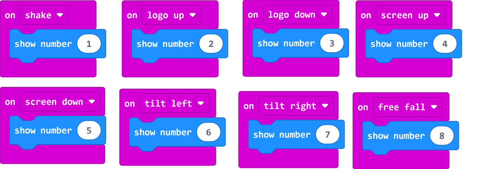

5.实验现象1:

按照之前的方式将代码下载到micro:bit V2主板，利用micro USB数据线上电，将micro:bit V2主板晃动，则可见LED点阵显示数字1（表明只要有晃动，无论朝哪个方向晃动，该条件都将满足）。

当micro:bit V2主板的Logo朝上时，LED点阵显示数字2，Logo朝上示意图如下所示：

同理，micro:bit V2主板的Logo朝上时，LED点阵显示数字3(倒立的3)，Logo朝下示意图如下所示：

当屏幕朝上（指的是LED点阵朝上）时，LED点阵显示数字4。如下图所示：

同理，当屏幕朝下（指的是LED点阵朝下）时，LED点阵显示数字5。

当micro:bit V2主板向左倾斜（是指LED点阵先朝上，然后再往左边倾斜）时，LED点阵显示数字6。如下图所示：

同理，当micro:bit V2主板向右倾斜（是指LED点阵先朝上，然后再往左边倾斜）时，LED点阵显示数字7。如下图所示：

当不小心碰到micro:bit V2主板使其从桌面掉落，则为做自由落体运动，此时，micro:bit V2主板满足自由落体的条件，则LED点阵显示数字8。（注意：此方法操作时，很容易把micro:bit V2主板摔坏，不建议操作）

注意：（3g、6g、8g，
如果需要满足此条件，则需要达到3倍，6倍，8倍重力加速度甩动micro:bit主板。如果你们有兴趣的话，这部分代码可以自己添加）

6.示例代码2：

7.实验现象2：

按照之前的方式将代码下载到micro:bit V2主板，利用micro USB数据线上电，点击“显示控制台(设备)”按钮：

首先，查阅MMA8653FC数据手册，以及micro:bit V2主板的硬件原理图得知，micro:bit V2主板的加速度计坐标如下图所示：

显示出如下界面：分别显示了加速度在X轴，Y轴，Z轴的分解值，以及加速度的合成(重力加速度及其它外力作用的加速度合成):

如果你的电脑系统是Windows7/8而不是Windows 10，则在Google Chrome中是无法进行设备配对，这里需要使用CoolTerm软件来读取串口数字的。

打开CoolTerm，点击Options，选择SerialPort，设置COM口和波特率，波特率设置为115200（经过测试，micro:bit V2主板的USB串口通讯波特率默认是115200），点击OK后，最后点击Connect。CoolTerm串口监视器分别显示了加速度X轴、Y轴、Z轴的数据，如下图：

## 实验 8: 光照强度检测

1.实验介绍:

本实验项目将介绍micro:bit V2主板对外界光照强度的检测，是通过LED点阵检测光线强度的，原理是通过反复的将LED驱动器转换成输入并采样电压衰弱时间，这与环境光的水平大致成正比。就当做是一个光敏传感器来使用就可以了。

2.所需组件:

- Micro:bit V2主板\*1

- Micro USB 线\*1

3.实验接线:

通过micro USB线将micro:bit V2主板连接到你的电脑上。

4.示例代码:

5.  实验现象:

按照之前的方式将代码下载到micro:bit V2主板，利用micro USB数据线上电，点击“显示控制台(设备)”按钮：

显示串口输出数据，用手全部遮住micro:bit V2主板的LED点阵，光线亮度级别约为0；然后将micro:bit V2主板的LED点阵放置于光照下，随着光照强度增强，亮度级别值也在逐渐增大。如下图所示：

代码中的20是一个随意设置的光照强度级别值，如果当前光照强度级别小于等于20，月亮就会出现在micro:bit V2主板的LED点阵上。如果大于20时，太阳就会出现。

如果你的电脑系统是Windows7/8而不是Windows 10，则在Google Chrome中是无法进行设备配对，这里需要使用CoolTerm软件来读取串口数字的。

打开CoolTerm，点击Options，选择SerialPort，设置COM口和波特率，波特率设置为115200（经过测试，micro:bit V2主板的USB串口通讯波特率是115200），点击OK后，最后点击Connect。这样，CoolTerm串口监视器显示光线亮度级别值。

## 实验 9: 扬声器

1.  实验介绍：

新款的micro:bit V2主板有内置扬声器，这使得在你的项目中添加声音变得非常容易。通过编程使扬声器发出各种各样的音调，例如编写一首歌曲：《欢乐颂》，让扬声器播放出来。

2.所需组件:

- Micro:bit V2主板\*1

- Micro USB 线\*1

3.实验接线:

通过micro USB线将micro:bit V2主板连接到你的电脑上。

4.示例代码1:

5.实验现象1:

按照之前的方式将代码下载到micro:bit V2主板，利用micro USB数据线上电，micro:bit V2主板上的扬声器发出声音且LED点阵显示音乐标志图案.

6.示例代码2:

歌曲《欢乐颂》的简谱如下：

更多音乐简谱知识的相关链接：[https://en.wikipedia.org/wiki/Numbered_musical_notation](https://en.wikipedia.org/wiki/Numbered_musical_notation)

7.  实验现象2:

按照之前的方式将代码下载到micro:bit V2主板，利用micro USB数据线上电，micro:bit V2主板上的内置扬声器播放一首《欢乐颂》歌曲。

## 实验 10: 触摸感应logo

1.  实验介绍：

如果你有了新款的micro:bit V2主板，你可以在你的项目中使用金色的触摸感应logo作为另一个输入，这就像多了一个按钮。触摸感应采用的是电容式触摸传感器，当你手指按下（或触摸）它时，它就能感应到电场的微小变化----就像你的手机或平板电脑屏幕一样。当你像按按钮一样按下它时，你可以在程序中触发事件。

2.所需组件:

- Micro:bit V2主板\*1

- Micro USB 线\*1

3.实验接线:

通过micro USB线将micro:bit V2主板连接到你的电脑上。

4.示例代码:

5.实验现象:

按照之前的方式将代码下载到micro:bit V2主板，利用micro USB数据线上电，手指按住micro:bit V2主板上“Logo”标志处，micro:bit V2主板上的LED点阵显示“❤”图案；手指松开micro:bit V2主板上“Logo”标志处，会出现数字。

## 实验 11: 麦克风

1.实验介绍：

新款的micro:bit V2主板有一个内置麦克风，可以测量环境的声音程度。你可以使用它作为一个简单的输入---当你鼓掌时，micro:bit主板上前面内置麦克风LED指示灯会被打开。它还可以测量声音的强度，所以你可以制作一个噪音等级表或与音乐合拍的迪斯科灯光。麦克风是在新款的micro:bit V2的背面，而在前面，你会发现一个内置麦克风LED指示灯，还有紧挨着让声音进入麦克风的孔。当你的micro:bit V2主板在测量声音级别时，它就会亮起来。

2.所需组件:

- Micro:bit V2主板\*1

- Micro USB 线\*1

3.实验接线:

通过micro USB线将micro:bit V2主板连接到你的电脑上。

4.示例代码1:

5.实验现象1：

按照之前的方式将代码下载到micro:bit V2主板，利用micro USB数据线上电，当你鼓掌时，micro:bit V2主板上的LED点阵显示“❤”图案；当外界环境安静时，micro:bit V2主板上的LED点阵显示“”图案。

6.  示例代码2:

7.  实验现象2：

按照之前的方式将代码下载到micro:bit V2主板，利用micro USB数据线上电，点击“显示控制台(设备)”按钮：

显示串口输出数据，当外界环境的声音增大时，串口输出的声音级别值也增大，如下图所示：

并且，当你按下micro:bit V2主板上的A键时，micro:bit V2主板上的LED点阵显示检测到的此时环境中最大声音级别值（这里需要注意：通过按micro:bit背面的重置按钮重置最大值。）；当鼓掌时，LED点阵显示声音级别大小图案。

## 实验 12: 读取蓝牙数据

1.  实验说明：

micro:bit V2主板自带了[nRF52833](https://www.nordicsemi.com/Products/Low-power-short-range-wireless/nRF52833)处理器（内置蓝牙5.1低功耗的BLE(Bluetooth Low Energy)设备）以及2.4GHz天线，可进行蓝牙无线通信和2.4GHz无线通信。使得micro:bit V2主板可以与各种蓝牙设备进行通信，包括智能手机和平板电脑。

在本实验中，主要讲解micro:bit V2主板实现蓝牙无线通信功能，我们可以通过连接蓝牙，实现无线传输代码（信号）功能。我们利用一个苹果系统设备（手机/iPad）和micro:bit V2主板连接，实现无线传输功能。设置安卓系统手机实现无线传输方法和苹果系统设备（手机/iPad）类似，这里就不一一介绍了。

2.  准备：

1.  通过micro USB线将micro:bit V2主板连接到电脑上。

2.  苹果系统设备（手机/iPad）或安卓系统手机。

3.  实验步骤：

（1）如果你的智能手机/iPad是苹果系统的，需要先在电脑上进入网页：<https://www.microbit.org/get-started/user-guide/ble-ios/>
，点击“Download pairing HEX file”下载micro:bit的固件到创建的文件夹中或电脑桌面上，并将下载好的micro:bit固件烧入micro:bit V2主板中。（这一步只针对于苹果系统的智能手机/iPad）

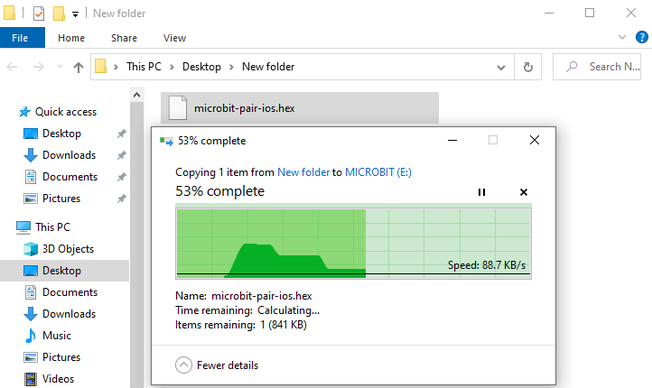

（2）在苹果系统设备（手机/iPad）上打开，在App Store的搜索框中输入“micro bit”，然后选中micro:bit
选项，会出现下载界面（如下图所示：），点击“”，就可以下载安装对应的APP。

（3）苹果系统设备（手机/iPad）和micro:bit V2主板配对连接。

1.  打开苹果系统设备（手机/iPad）上的蓝牙。

2.  APP安装成功后，点击打开APP，先确定micro     USB数据线已经将micro:bit     V2主板和电脑连接上，再点击APP的第一项“Choose     micro:bit”，开始配对蓝牙。

3.  点击配对一个新的micro:bit，开始配对。

4.  根据提示，首先同时按住micro:bit     V2主板上的按键A和B，然后按下micro:bit     V2主板后面的复位&电源按钮几秒钟（按键A和B不能松开），再松开复位&电源按钮，micro:bit     V2主板上LED点阵会显示一个密码图案。最后松开micro：bit     V2主板上的按键A和B，接着点击“下一步”。

5.  在苹果系统手机/iPad上设置密码图案，使图案和micro:bit     V2主板上显示的密码图案一样，点击“下一步”。

6.  点击“下一步”，出现对话框，在对话框中点击“Pair”。几秒钟后，配对成功，同时micro:bit     V2主板上的LED点阵显示“√”图案。

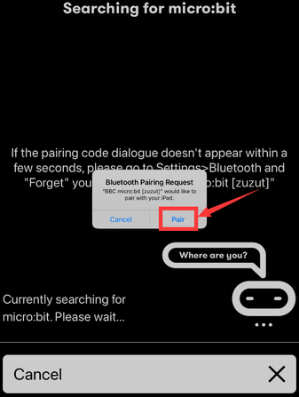

（3）蓝牙配对成功后，开始利用APP编写代码，并上传代码。

a.点击第二项“Create Code”，进入编程界面，开始编写代码程序。（点击，出现对话框，在对话框中直接点击“Create
√”后就进入编程界面）

b\.
将代码程序项目名称设置为“1”，点击保存图案“”，保存代码程序。

c.项目代码程序保存成功后，点击第三项“Flash”进入上传代码程序界面。默认选择代码程序是刚刚保存的项目名称为“1”的代码程序，然后点击“Flash”上传代码程序“1”。

d.几秒钟后，代码程序“1”上传成功，会显示如下图。然后micro:bit V2主板上的LED点阵显示跳跃的“心”对应图案。

## 实验13 LED闪烁

实验说明

LED 闪烁实验是比较基础的实验之一，在之前的项目中，我们控制的是micro:
bit自带的5 x 5 LED点阵。在这个实验中我们外接一个keyes
草帽LED白发白模块，然后控制模块上LED闪烁，实验中我们先关闭5 x 5 LED点阵功能。

实验器材

micro：bit主板\*1

keyes micro bit 传感器V2扩展板\*1

USB线\*1

keyes 草帽LED白发白模块\*1

杜邦线若干

接线图

测试代码

测试结果

按照接线图接好线，上传完代码，上电后，我们就可以看到keyes
草帽LED白发白模块 上LED不停闪烁，间隔大约为1秒。

## 实验14 呼吸灯

实验说明

在这个实验中，我们外接keyes 食人鱼LED白光模块到扩展板上。实际上keyes
食人鱼LED白光模块和上一课用到的keyes
草帽LED白发白模块功能完全一样，二者可以替换使用，只是模块上LED外观了亮度一些不同。

实验中，我们将keyes
食人鱼LED白光模块信号端接到了micro：bit主板的P0上。从micro:bit
引脚说明我们知道P0还可以当做模拟信号输入端口。实验中我们通过P0端口控制模块上LED亮度，是它逐渐变亮，然后逐渐变暗，循环交替，模拟人体呼吸现象。

实验器材

micro：bit主板\*1

keyes micro bit 传感器V2扩展板\*1

USB线\*1

keyes 食人鱼LED白光模块\*1

杜邦线若干

接线图

测试代码

测试结果

按照接线图接好线，上传完程序，上电后，我们就可以看到keyes
食人鱼LED白光模块上LED先逐渐变亮，然后逐渐变暗，循环交替，和人体呼吸一样。

## 实验15 LED闪烁和人体呼吸

实验说明

在这个实验中，我们外接keyes 3W LED模块到扩展板上。实际上keyes 3W LED模块和上两课课用到的LED
模块使用方法完全一样，可以替换使用，只是这个模块模块上LED用了3W LED，亮度特别大，我们完全可以将它用来照明。

这个实验，我们是将实验六和实验七结合起来，我们先控制模块上LED闪烁2次，然后再让模块LED模拟人体呼吸2次，二者循环交替。

实验器材

micro：bit主板\*1

keyes micro bit 传感器V2扩展板\*1

USB线\*1

keyes 3W LED模块\*1

杜邦线若干

接线图

测试代码

测试结果

按照接线图接好线，上传完代码，上电后，我们就可以看到keyes 3W LED模块上LED闪烁2次，然后再模拟人体呼吸2次，二者循环交替。

## 实验16 断开的声音

实验说明

蜂鸣器可分为有源蜂鸣器和无源蜂鸣器两种。有源蜂鸣器内部有一简单的振荡电路，能将恒定的直流电转化成一定频率的脉冲信号。本课程中用到了keyes
有源蜂鸣器模块，模块上焊接的是有源蜂鸣器。

实验中中我们将keyes
有源蜂鸣器模块的信号的接到了micro：bit主板的P7端。当我们给P7端输入高电平时，蜂鸣器持续响起。在这里我们参考LED闪烁实验，我们控制模块上蜂鸣器循环响起和关闭，就相当于把声音截成一段一段的。

实验器材

micro：bit主板\*1

keyes micro bit 传感器V2扩展板\*1

USB线\*1

keyes 有源蜂鸣器模块\*1

杜邦线若干

接线图

测试代码

测试结果

按照接线图接好线，上传完代码，上电后，我们就可以听到keyes
有源蜂鸣器模块上蜂鸣器循环响起和关闭，就相当于把声音截成一段一段的。

## 实验17 编辑你的音乐

实验说明

蜂鸣器可分为有源蜂鸣器和无源蜂鸣器两种。本课程中主要用到了无源蜂鸣器，无源蜂鸣器内部不带振荡源，直流信号无法令其鸣叫，须用方波驱动。

蜂鸣器可分为有源蜂鸣器和无源蜂鸣器两种。无源蜂鸣器内部不带振荡源，直流信号无法令其鸣叫，须用方波驱动。本课程中用到了keyes
无源蜂鸣器模块，模块上焊接的是无源蜂鸣器。

实验中中我们将keyes
无源蜂鸣器模块的信号的接到了micro：bit主板的P0端。在这一课程中，我们完成两个实验，一个是直接控制输入P0的高低电平，设置两个方波，控制模块上蜂鸣器响起；另一个是利用软件自带功能，在P0端输入不同频率、不同长度的方波，最终是模块上蜂鸣器响起《欢乐颂》的曲子（这是输入的PIO口只能是P0，不能是其它接口）。

实验器材

micro：bit主板\*1

keyes micro bit 传感器V2扩展板\*1

USB线\*1

keyes 无源蜂鸣器模块\*1

杜邦线若干

接线图

测试代码

代码1

代码2

注意：点击软件中图标，我们可以看到程序中各个音频的频率，如下图。

测试结果

按照接线图接好线，上传完代码1，上电后，我们就可以听到keyes
无源蜂鸣器模块上蜂鸣器循环响起两种声音。上传完代码2，上电后，我们就可以听keyes
无源蜂鸣器模块上蜂鸣器循环响起《欢乐颂》的曲子。

## 实验18 自由搭配你的颜色

实验说明

RGB色彩模式是工业界的一种颜色标准，是通过对红(R)、绿(G)、蓝(B)三个颜色通道的变化以及它们相互之间的叠加来得到各式各样的颜色的，RGB即是代表红、绿、蓝三个通道的颜色，这个标准几乎包括了人类视力所能感知的所有颜色，是目前运用最广的颜色系统之一。

这个实验中我们用到了keyes
插件RGB模块，它是共阴极RGB模块。在这个实验中，我们把控制模块红绿蓝三个颜色通道的信号端接到了micro：bit主板的P0 P1 P2接口上，根据引脚说明，这3个引脚也是模拟输入信号端口。在实验中，我们通过控制P0 P1 P2的模拟输入值，首先控制模块RGB灯显示红绿蓝三种颜色灯光，然后控制RGB灯快速变换颜色。

实验器材

micro：bit主板\*1

keyes micro bit 传感器V2扩展板\*1

USB线\*1

keyes 插件RGB模块\*1

杜邦线若干

接线图

测试代码

测试结果

按照接线图接好线，上传完代码，上电后，我们就可以看到keyes
插件RGB模块上RGB灯显示红绿蓝三种颜色灯光，然后RGB灯快速变换颜色，循环交替。

## 实验19 外接按键

实验说明

在做你设计电路时，按键开关是最常用的一种元件。尽管micro：bit主板上自带了两个按键，但是有时设计电路还是需要用到外接按键。

在这里我们就外接一个keyes 按键传感器
到扩展板，然后控制micro：bit主板上LED点阵显示不同图案。

实验器材

micro：bit主板\*1

keyes micro bit 传感器V2扩展板\*1

USB线\*1

keyes 按键传感器 \*1

杜邦线若干

接线图

测试代码

测试结果

按照接线图接好线，上传完代码，上电后，按下模块上按键，micro：bit主板上LED点阵显示图案，否则显示
图案。

## 实验20 左右倾斜

实验说明

在你做电路设计时，有时候你需要测试一个物体是否左右倾斜，这样你就可以用到keyes
倾斜模块传感器。它主要是利用滚珠在开关内随不同倾斜角度的发化，达到触发电路的目的。

我们外接一个keyes 倾斜模块传感器 到扩展板，通过左右倾斜keyes
倾斜模块传感器 ，然后控制micro：bit主板上LED点阵显示不同图案。

实验器材

micro：bit主板\*1

keyes micro bit 传感器V2扩展板\*1

USB线\*1

keyes 倾斜模块传感器 \*1

杜邦线若干

接线图

测试代码

测试结果

按照接线图接好线，上传完代码，上电后，keyes micro bit
传感器V2扩展板倾向左边，micro：bit主板上LED点阵显示图案，倾向右边显示
图案。

## 实验21 光遮断的演示

实验说明

在日常生活中，我们经常需要实现计数和测速功能。keyes
光折断传感器和单片机搭配使用，利用代码调试就可以实现这些功能。它的原理非常简单，它主要由光遮断器组成，当我们用纸片挡住光遮断器凹槽时，模块信号端发生变化。测试时，我们让物体因为运动，而不断有物体挡住光遮断器凹槽，模块信号端就不断出现高低电平变化，然后我们通过模块信号端数据，计算出物体运动情况，即可达到计数和测速的功能。

在这里，我们将keyes
光折断传感器接到扩展板，模拟物体挡住和不挡住光遮断器凹槽，观察信号变化，然后控制micro：bit主板上LED点阵显示不同图案。

实验器材

micro：bit主板\*1

keyes micro bit 传感器V2扩展板\*1

USB线\*1

keyes 光折断传感器\*1

杜邦线若干

接线图

测试代码

测试结果

按照接线图接好线，上传完代码，上电后，用纸片挡住keyes 光折断传感器上光遮

断器凹槽，micro：bit主板上LED点阵显示图案，否则显示
图案。

## 实验22 电容触摸按键

实验说明

在实验十二中，我们做了外接按键模块的实验。这一课程中我们用到了keyes
电容触摸传感器，让完全可以替代按键模块。它主要由触摸检测IC等组成。触摸检测IC是为了用可变面积的键取代传统的按钮键而设计的，具有低功耗和宽工作电压的特点。当我们上电之后，传感器需要约0.5sec的稳定时间，此时间段内不要对键进行触摸，此时所有功能都被禁止，始终进行自校准，当键没被触摸时，重校准周期约为4.0sec。传感器可用于防水电器、按钮键取代品等地方。

在这里我们就外接一个keyes
电容触摸传感器到扩展板，然后控制micro：bit主板上LED点阵显示不同图案。

实验器材

micro：bit主板\*1

keyes micro bit 传感器V2扩展板\*1

USB线\*1

keyes 电容触摸传感器\*1

杜邦线若干

接线图

测试代码

测试结果

按照接线图接好线，上传完代码，上电后，待传感器稳定后，触摸传感器感应区域，micro：bit主板上LED点阵显示图案，否则显示
图案。

## 实验23 模拟交通灯

实验说明

当我们走在十字路口上，我们到处到可以看到红绿灯指挥着行人和车辆有序的运行。然而红绿灯是怎样被控制运行呢？

在这里我们将一个Keyes
红绿灯模块接到扩展板上，由micro：bit主板控制模块上3个灯的闪烁，完全模拟一个红绿灯的运行。

实验器材

micro：bit主板\*1

keyes micro bit 传感器V2扩展板\*1

USB线\*1

Keyes 红绿灯模块\*1

杜邦线若干

接线图

测试代码

测试结果

按照接线图接好线，上传完代码，上电后，绿灯亮5秒，熄灭，黄灯闪烁3次，间隔为0.5秒，然后熄灭，然后红灯亮，亮5秒，熄灭，绿灯亮起，循环交替。

## 实验24 磁场的存在

实验说明

在日常生活中传感器无处不在，户外公共的路灯，一到白天自动亮起，一到晚上自动熄灭，这就是用到了光照传感器。楼道电灯，当人走过发出声音时，电灯自动亮起，过后，安静下来，电灯关闭，这用到了声音传感器。

这一课程中我们用到keyes
霍尔传感器，它的主要元件是A3144E，它是检测磁场的传感器，是信号端输出的是数字信号，只能检测周围是否存在磁场，检测不出磁场强度。在这里，我们将keyes
霍尔传感器到扩展板，观察信号变化，然后控制micro：bit主板上LED点阵显示不同图案。

实验器材

micro：bit主板\*1

keyes micro bit 传感器V2扩展板\*1

USB线\*1

keyes 霍尔传感器\*1

杜邦线若干

接线图

测试代码

测试结果

按照接线图接好线，上传完代码，上电后，传感器感应到附近磁场时，micro：bit主板上LED点阵显示图案，否则显示
图案。

## 实验25 跟着黑线走

实验说明

当我们在做DIY实验中，我们经常可以看到别人DIY这样一款小车，小车直接沿着黑色的线行走，不会超出黑线范围，那这又是一个什么原理呢？

实际上它主要用到了3个keyes
巡线传感器，可以检测小车底下是否是黑线，然后根据检测结果控制小车运动，从而实现小车沿黑线行走。那keyes
巡线传感器又是怎么检测黑色的线呢？

原来每一个keyes
巡线传感器都带有一个TCRT5000红外对管，它的工作原理是利用红外线对颜色的反射率不一样，将反射信号的强弱转化成电流信号。当检测到黑线时，红外线没有发射或者发射回来强度不够大，这样传感器信号端输出高电平，否则传感器信号端输出低电平。这样我们就可以通过传感器信号端高低电平情况，判断检测到的颜色了。

在这里，我们将keyes
巡线传感器到扩展板，控制micro：bit主板上LED点阵显示测试结果。

实验器材

micro：bit主板\*1

keyes micro bit 传感器V2扩展板\*1

USB线\*1

keyes 巡线传感器\*1

杜邦线若干

接线图

测试代码

测试结果

按照接线图接好线，上传完程序，上电后，当传感器没有检测到物体或检测到黑线时，那么，红外线没有发射或者发射回来强度不够大，那么传感器信号端输出为高电平，micro：bit主板上LED点阵显示数字1，否则显示数字0。

特别注意：我们旋转传感器上电位器，使传感器上D1 LED介于亮与不亮之间，灵敏度

最高。传感器的检测高度为   0—3cm。

## 实验26 前方有障碍物

实验说明

同样的DIY小车，我看过这样一款小车，小车自动避开前方障碍物，自动沿着我们预设好的线路行走，那这又是一个什么原理呢？

实际上它主要用到了3个keyes 避障传感器
，可以检测小车前方是否有障碍物，然后根据检测结果控制小车运动，使小车避开障碍物，沿着预定轨道前进。那keyes
避障传感器又是怎么检测前方障碍物呢？

原来每一个keyes
避障传感器都带有具有一对红外线发射管与接收器，发射管发射出一定频率的红外线，红外线遇到障碍物，被反射到达接收器，接收器收到红外线后，传感器信号端输出为低电平；如果没有障碍物，发射出去的红外线，因为传播距离越远而逐渐减弱，最后消失，接收器没有收到红外线，传感器信号端输出为高电平。这样我们就可以通过传感器信号端高低电平情况，判断前方是否有障碍物了。

在这里，我们将keyes
避障传感器到扩展板，控制micro：bit主板上LED点阵显示测试结果。

实验器材

micro：bit主板\*1

keyes micro bit 传感器V2扩展板\*1

USB线\*1

keyes 避障传感器\*1

杜邦线若干

接线图

测试代码

测试结果

按照接线图接好线，上传完代码，上电后，当传感器检测前方有障碍物时，那么传感器信号端输出为低电平，micro：bit主板上LED点阵显示数字0，否则显示数字1。

特别注意：我们可以调节传感器上两个电位器，调节它的灵敏度。靠近红外发射管的电位器顺时针调到尽头，再调节靠近红外接收器的电位器，观察D2灯，使D2灯关闭，并且保持将要亮起的临界点，此时感应距离最长。传感器的有效距离为2～40cm。

## 实验27 有人来了

实验说明

我们在影视剧中看过这样的镜头，有人去偷袭一个目标时，还没有靠近目标，就直接被发现，而警报响起。有些特种兵去偷袭目标时，会再全身涂满湿润的泥巴，这样就不会给对方发现了，那这是为什么呢？

原来普通人体会发射10um左右的特定波长红外线，被偷袭的目标附近都安装了相关传感器能够感应到人体发射的红外线，然后报警，涂满泥巴后，传感器就感应不到人体发射的红外线了。

在这里，我们用keyes
人体红外热释电传感器来检测附近是否有人运动，假如附近有人运动时，传感器信号端输出高电平，否则输出低电平。特别注意，这个传感器只能检测在运动中的人体，静止中的人体检测不到，检测距离最远为7米。

实验中，我们将keyes
人体红外热释电传感器接到扩展板，观察信号变化，然后控制micro：bit主板上LED点阵显示不同图案。

实验器材

micro：bit主板\*1

keyes micro bit 传感器V2扩展板\*1

USB线\*1

keyes 人体红外热释电传感器\*1

杜邦线若干

接线图

注：调节距离电位器（RP2）顺时针旋转，感应距离增大（约7米），反之，感应距离减小（约3米）。

调节延时电位器（RP1）顺时针旋转，感应延时加长（约300S），反之，感应延时减短（约5S）。

测试代码

测试结果

按照接线图接好线，上传完代码，上电后，传感器感应到附近有人运动时，micro：bit主板上LED点阵显示图案，否则显示
图案。

## 实验28 着火啦

实验说明

在生活中，我们发现有很多地方出现火灾，没有及时救火，导致火势愈演愈烈，最终造成重大损失。那么有没有办法避免这种情况呢？有，就是在容易着火的地方安装火焰传感器和喇叭，当火焰传感器检测到附近着火时，喇叭及时发出声音报警，提醒人们及时救火；甚至还可以直接和灭火器连接，在提醒人们救火的同时，自动控制灭火器灭火。

在这里我们用一个keyes 火焰传感器和一个keyes
有源蜂鸣器模块模拟自动报警系统。当keyes 火焰传感器检测到火焰时，keyes
有源蜂鸣器模块上蜂鸣器直接响起报警。

注意keyes
火焰传感器可以检测火焰或者波长在760纳米～1100纳米范围内的光源，它的探测角度为60度左右。我们可以通过旋转传感器上电位器，可以调节它的灵敏度。当调节电位器使传感器上LED介于不亮与亮之间的临界点时，灵敏度最好。

实验器材

micro：bit主板\*1

keyes micro bit 传感器V2扩展板\*1

USB线\*1

keyes 火焰传感器\*1

keyes 有源蜂鸣器模块\*1

杜邦线若干

接线图

测试代码

测试结果

按照接线图接好线，上传完代码，上电后，传感器感应到附近有火焰时，模块上蜂鸣器响起，否则蜂鸣器关闭。

## 实验29 到顶部了

实验说明

在我们DIY过程中，经常要用的一个机器-3D打印机，有了它，我们可以打印出想要的各种结构器件了。在打印接里，限位开关必不可少，它主要提供打印机XYZ轴是否到达边界点的信息。keyes
碰撞传感器也是一款限位开关，完全可以用在3D打印机上。它本质上它和按键模块一样，当打印机到顶部时，挤压弹簧片，模块输出低电平，离开顶部，松开弹簧片，模块输出高电平。

在这里我们用一个keyes 碰撞传感器和一个keyes
有源蜂鸣器模块模拟3D打印机限位。当keyes 碰撞传感器到顶时，keyes
有源蜂鸣器模块上蜂鸣器直接响起报警。

实验器材

micro：bit主板\*1

keyes micro bit 传感器V2扩展板\*1

USB线\*1

keyes 碰撞传感器\*1

keyes 有源蜂鸣器模块\*1

杜邦线若干

接线图

测试代码

测试结果

按照接线图接好线，上传完代码，上电后，按下传感器弹片时，模块上蜂鸣器响起，否则蜂鸣器关闭。

## 实验30 磁场开关

实验说明

我们在第十七课中用keyes
霍尔传感器来检测附近是否存在磁场。实际上检测磁场的元件不只是这个，keyes
干簧管模块也可以用来检测附近是否存在磁场。那二者之间有什么区别呢？

keyes
干簧管模块主要由干簧管组成，干簧管为机械式的磁敏开关，无源器件。其工作原理是磁场磁化其簧片，使其开启与关断达到开关的效果。但由于是接触式的开关，其工作寿命有限制，而且运输、安装过程中易损坏。

keyes
霍尔传感器的主要元件是A3144E，它是电子式的磁敏器件，有源器件，输出形式为开关型。它利用磁场和霍尔效应达到无接触式控制的目的。由于霍尔元件本身是一颗芯片，其工作寿命理论上无限制。

在这里，我们将keyes
干簧管模块到扩展板，观察信号变化，然后控制micro：bit主板上LED点阵显示不同图案。

实验器材

micro：bit主板\*1

keyes micro bit 传感器V2扩展板\*1

USB线\*1

keyes 干簧管模块\*1

杜邦线若干

接线图

测试代码

测试结果

按照接线图接好线，上传完代码，上电后，模块感应到附近磁场时，micro：bit主板上LED点阵显示图案，否则显示
图案。

## 实验31 继电器的作用

实验说明

在生活中，我们一般用220V的交流电来驱动电器设备。有时候我们需要用到开关来控制电器，假如直接把开关接到220V的交流电电路中，一旦漏电，那么就会危及人身安全，这样不好。于是我们就设计了一个继电器模块。这个继电器模块常开（NO）和常闭（NC）接口，它是高电平有效。

使用时我们在-
+供电5V，S接信号端，当给S高电压时，驱动继电器，即常开（NO）连通、常闭（NC）断开；当给S低电压时，关闭继电器，即常开（NO）断开、常闭（NC）连通。这样我们把220V的交流电电路接到常开（NO）或常闭（NC）接口，通过5V电压控制，安全方便。

在这里，我们将模拟继电器控制外接电路，我们用keyes 5V
单路继电器模块控制一个LED（为方便接线，电路中没有加220V电压，还是5V，原理是一样）的亮灭。

实验器材

micro：bit主板\*1

keyes micro bit 传感器V2扩展板\*1

USB线\*1

keyes 5V 单路继电器模块\*1

keyes 草帽LED白发白模块 \*1

杜邦线若干

接线图

测试代码

测试结果

按照接线图接好线，上传完代码，上电后，继电器开启，模块LED亮起，让后继电器关闭，模块LED熄灭，间隔1秒，循环交替。

## 实验32 超声波测试距离

实验说明

自然界有一种叫蝙蝠的动物，蝙蝠在夜间飞行不是靠眼睛看的，而是靠耳朵和发音器官飞行的。蝙蝠在飞行时，会发出一种尖叫声，这是一种超声波信号，是人类无法听到的，因为它的音频很高。这些超声波的信号若在飞行路线上碰到其他物体，就会立刻反射回来，在接收到返回的信息之后，蝙蝠于振翅之间就完成了听、看、计算与绕开障碍物的全部过程。

超声波测距模块的原理跟上面的原理是一样的，超声波测距模块一触发信号后发射超声波，当超声波投射到物体而反射回来时，模块输出一回响信号，以触发信号和回响信号间的时间差，来判定物体的距离。

在这里，我们将 HC-SR04
超声波模块接到扩展板上，用于测试超声波模块和前方障碍物的距离，并显示出来。

实验器材

micro：bit主板\*1

keyes micro bit 传感器V2扩展板\*1

USB线\*1

HC-SR04 超声波模块\*1

杜邦线若干

接线图

测试代码

代码1

代码2

利用库文件设置代码

在下图模块搜索sonar

点击下图自动下载库文件了，然后在编辑代码栏目里看到对应模块。

测试结果

按照接线图接好线，陆续上传两个程序，上电后，两个程序实验现象一致。结果显示超声波模块和障碍之间的距离，单位为cm。我们有两种方法看到测试数据，一是直接在micro：bit主板上LED点阵上看到，二是利用CoolTerm软件看到显示结果。

打开CoolTerm，点击Options，选择SerialPort，设置COM口和波特率，波特率设置为115200（经过测试，micro:bit V2主板的USB串口通讯波特率默认是115200），点击OK后，最后点击Connect。CoolTerm串口监视器显测试结果，如下图：

## 实验33 光的亮度

实验说明

在生活中我们发现，很多公共场所的照明灯，一到晚上它就自动亮起来，一到白天

它就自动熄灭， 难道这些灯都是有人去控制吗？

实际上不是，实际上很多照明灯都是安装了一个感光元件，可以测量外界光的亮度，

当到晚上时，亮度低了，就自动控制路灯亮起；当到白天时，亮度高了，就自动控制路灯熄灭。

在这里，我们接keyes
光敏电阻传感器接到扩展板来测试外界光的亮度。我们需要用到micro：bit主板的模拟输入功能，只有几个特定的PIO口才有该功能，具体的可以参考micro:bit
引脚说明。实验中传感器信号端接的是P0端，将所测结果在micro：bit主板上LED点阵或串口监视器上显示。

实验器材

micro：bit主板\*1

keyes micro bit 传感器V2扩展板\*1

USB线\*1

keyes 光敏电阻传感器\*1

杜邦线若干

接线图

测试代码

测试结果

按照接线图接好线，上传代码，上电，光照越强，数值越大。我们有两种方法看到测试数据，一是直接在micro：bit主板上LED点阵上看到，二是利用CoolTerm软件看到显示结果。

打开CoolTerm，点击Options，选择SerialPort，设置COM口和波特率，波特率设置为115200（经过测试，micro:bit V2主板的USB串口通讯波特率默认是115200），点击OK后，最后点击Connect。CoolTerm串口监视器显测试结果，如下图：

## 实验34 我听到脚步声了

实验说明

在生活中，当我们晚上经过楼道时，如果脚步方轻，黑漆漆一片，而当我们加重脚步，或者大叫一声，楼道里的照明灯就会陆续亮起。

实际上楼道里的照明电路里安装有声音传感器，当检测当外界声音时，控制开启照明灯，否则关闭照明灯。

在这实验中，我们keyes
麦克风声音传感器的信号端接到micro：bit主板的P0，通过读取P0端的模拟值，来检测外界的声音大小。检测时，外界声音越大，模拟值越大。我们将所测的模拟值在micro：bit主板上LED点阵或串口监视器上显示。

注意：keyes
麦克风声音传感器是用来调节声音的放大倍数，顺时针旋转电位器，增大

放大倍数。

实验器材

micro：bit主板\*1

keyes micro bit 传感器V2扩展板\*1

USB线\*1

keyes 麦克风声音传感器\*1

杜邦线若干

接线图

测试代码

测试结果

按照接线图接好线，上传代码，上电，声音越大测试数据越大。我们有两种方法看到测试数据，一是直接在micro：bit主板上LED点阵上看到，二是利用CoolTerm软件看到显示结果。

打开CoolTerm，点击Options，选择SerialPort，设置COM口和波特率，波特率设置为115200（经过测试，micro:bit V2主板的USB串口通讯波特率默认是115200），点击OK后，最后点击Connect。CoolTerm串口监视器显测试结果，如下图：

## 实验35 电位器的使用

实验说明

当我们在做DIY实验时，我们经常要用到电位器模块。电位器模块实际上主要用的就是一个可调电阻，当我们在旋转电位器时，实际上就是改变可调电器的电阻。我们设置对应电路，将电阻阻值的变化，转换成电压的变化。然后将电压变化通过模块信号端输入到micro：bit主板的模拟输入口检测。

在这实验中，我们keyes
可调电位器模块的信号端接到micro：bit主板的P0，通过读取P0端的模拟值，旋转电位器，模拟值数据改变。我们将所测的模拟值在micro：bit主板上LED点阵或串口监视器上显示。

实验器材

micro：bit主板\*1

keyes micro bit 传感器V2扩展板\*1

USB线\*1

keyes 可调电位器模块\*1

杜邦线若干

接线图

测试代码

测试结果

按照接线图接好线，上传代码，上电，旋转电位器，数据变化。我们有两种方法看到测试数据，一是直接在micro：bit主板上LED点阵上看到，二是利用CoolTerm软件看到显示结果。

打开CoolTerm，点击Options，选择SerialPort，设置COM口和波特率，波特率设置为115200（经过测试，micro:bit V2主板的USB串口通讯波特率默认是115200），点击OK后，最后点击Connect。CoolTerm串口监视器显测试结果，如下图：

## 实验36 空气中的酒精含量

实验说明

在现实生活中经常出现气体泄漏事件，若是无危害的气体还好，若是有毒或者易燃易爆气体，那就存在了巨大的安全隐患。为此，人们研发了各种传感器来检测空气中的各种气体含量，方便及时发现泄漏的气体，及时报警处理。

实验中，我们用keyes MQ-3
酒精传感器来检测空气在的酒精含量。传感器有两个信号端，模拟口A0和数字口D0。当检测到酒精浓度越高，A0数值越大；当检测到酒精浓度到达一定时，A0到达一定数值时，D0由低电平变为高电平，该数值可由电位器控制。

在这实验中，我们keyes MQ-3
酒精传感器的A0信号端接到micro：bit主板的P0，通过读取P0端的模拟值，检测空气中酒精含量。我们将所测的模拟值在micro：bit主板上LED点阵或串口监视器上显示。

实验器材

micro：bit主板\*1

keyes micro bit 传感器V2扩展板\*1

USB线\*1

keyes MQ-3 酒精传感器\*1

杜邦线若干

接线图

测试代码

测试结果

按照接线图接好线，上传代码，上电，读取到A0信号端数据，酒精浓度越高，数据越大。我们有两种方法看到测试数据，一是直接在micro：bit主板上LED点阵上看到，二是利用CoolTerm软件看到显示结果。

打开CoolTerm，点击Options，选择SerialPort，设置COM口和波特率，波特率设置为115200（经过测试，micro:bit V2主板的USB串口通讯波特率默认是115200），点击OK后，最后点击Connect。CoolTerm串口监视器显测试结果，如下图：

## 实验37 空气中的可燃气体

实验说明

在上一课程中，我们检测了空气中的酒精浓度情况。这一课程中，我们利用keyes MQ-2 烟雾传感器来检测空气中的可燃气体，如液化气、丙烷、氢气等。keyes MQ-2
烟雾传感器对液化气、丙烷、氢气的灵敏度高，对天然气和其它可燃蒸汽的检测也很理想。它可检测多种可燃性气体，是一款适合多种应用的低成本传感器。

keyes MQ-2
烟雾传感器有两个信号端，模拟口A0和数字口D0。当检测到可燃气体浓度越高，A0数值越大；当检测到可燃气体浓度到达一定时，A0到达一定数值时，D0由低电平变为高电平，该数值可由电位器控制。

在这实验中，keyes MQ-2
烟雾传感器的A0信号端接到micro：bit主板的P0，通过读取P0端的模拟值，检测空气中可燃气体。我们将所测的模拟值在micro：bit主板上LED点阵或串口监视器上显示。

实验器材

micro：bit主板\*1

keyes micro bit 传感器V2扩展板\*1

USB线\*1

keyes MQ-2 烟雾传感器\*1

杜邦线若干

接线图

测试代码

测试结果

按照接线图接好线，上传代码，上电，读取到A0信号端数据，可燃气体浓度越高，数据越大。我们有两种方法看到测试数据，一是直接在micro：bit主板上LED点阵上看到，，二是利用CoolTerm软件看到显示结果。

打开CoolTerm，点击Options，选择SerialPort，设置COM口和波特率，波特率设置为115200（经过测试，micro:bit V2主板的USB串口通讯波特率默认是115200），点击OK后，最后点击Connect。CoolTerm串口监视器显测试结果，如下图：

## 实验38 测试环境温度

实验说明

在这一课程中，我们利用keyes LM35温度传感器测试出当前环境中的具体温度。keyes LM35温度传感器的信号端的输出电压与摄氏温标呈线性关系，转换公式如式，0时输出为0V，每升高1℃，输出电压增加10mV。

在这实验中，我们将keyes LM35温度传感器的A0信号端接到micro：bit主板的P0，通过读取P0端的模拟值，计算出温度值。我们将所测的温度值在micro：bit主板上LED点阵或串口监视器上显示。

实验器材

micro：bit主板\*1

keyes micro bit 传感器V2扩展板\*1

USB线\*1

keyes LM35温度传感器\*1

杜邦线若干

接线图

测试代码

测试结果

按照接线图接好线，上传代码，上电后，即可得到当前环境温度数值。我们有两种方法看到测试数据，一是直接在micro：bit主板上LED点阵上看到，，二是利用CoolTerm软件看到显示结果。

打开CoolTerm，点击Options，选择SerialPort，设置COM口和波特率，波特率设置为115200（经过测试，micro:bit V2主板的USB串口通讯波特率默认是115200），点击OK后，最后点击Connect。CoolTerm串口监视器显测试结果，如下图：

## 实验39 TEMT6000测试光线

实验说明

前面课程中，我们用光敏电阻传感器检测环境中光照。这一课程中我们主要用keyes TEMT6000光线传感器测试光线，测试方法类似。但是keyes TEMT6000光线传感器比光敏电阻传感器灵敏度高。

它主要由一个高灵敏可见光光敏（NPN型）三极管构成，可以将捕获的微小光线变化并放大100倍左右，并且轻松的被微控制器识别，进行AD转换。它对可见光照度的反应特性与人眼的特性类似，可以模拟人对环境光线的强度的判断，从而方便做出与人友好互动的应用。

在这实验中，我们将keyes TEMT6000光线传感器的信号端接到micro：bit主板的P0，通过读取P0端的模拟值，检测环境中光线。我们将所测的模拟值在micro：bit主板上LED点阵或串口监视器上显示。

实验器材

micro：bit主板\*1

keyes micro bit 传感器V2扩展板\*1

USB线\*1

keyes TEMT6000光线传感器\*1

杜邦线若干

接线图

测试代码

测试结果

按照接线图接好线，上传代码，上电，读取到信号端数据，光线越强，数据越大。我们有两种方法看到测试数据，一是直接在micro：bit主板上LED点阵上看到，，二是利用CoolTerm软件看到显示结果。

打开CoolTerm，点击Options，选择SerialPort，设置COM口和波特率，波特率设置为115200（经过测试，micro:bit V2主板的USB串口通讯波特率默认是115200），点击OK后，最后点击Connect。CoolTerm串口监视器显测试结果，如下图：

## 实验40 自动浇花系统

实验说明

在生活中，我们养一些花花草草，总要不定时的给他们浇水，防止它们渴死，但是又不能多浇，这些都需要经验。那我们可不可以做一个系统，让机器自动在土壤干燥的时候浇水呢？

可以的，我们首先在单片机上连接一个keyes土壤传感器，它是用来检测土壤中的干湿度，然后又在单片机上连接一个继电器模块，在继电器模块的常开（NO）两端接上抽水泵和抽水泵电源。当检测到土壤过干时，单片机控制继电器开启，NO端连通，抽水泵电源给抽水泵供电，抽水泵开始工作，抽水，给花草浇水；当检测到土壤过湿时，单片机控制继电器关闭，NO端断开，抽水泵电源停止给抽水泵供电，抽水泵停止工作。

在这实验中，我们只是将keyes土壤传感器的信号端接到micro：bit主板的P0，通过读取P0端的模拟值，检测土壤干湿度，湿度越大，模拟值越大。我们将所测的模拟值在micro：bit主板上LED点阵或串口监视器上显示。

实验器材

micro：bit主板\*1

keyes micro bit 传感器V2扩展板\*1

USB线\*1

keyes土壤传感器\*1

杜邦线若干

接线图

测试代码

测试结果

按照接线图接好线，上传代码，上电，读取到信号端数据，湿度越大，数据越大。我们有两种方法看到测试数据，一是直接在micro：bit主板上LED点阵上看到，，二是利用CoolTerm软件看到显示结果。

打开CoolTerm，点击Options，选择SerialPort，设置COM口和波特率，波特率设置为115200（经过测试，micro:bit V2主板的USB串口通讯波特率默认是115200），点击OK后，最后点击Connect。CoolTerm串口监视器显测试结果，如下图：

## 实验41 水位报警系统

实验说明

在生活中，一遇到大雨，河流或者水库中水位暴涨，到达一定水位时，需要开闸泄洪，解决安全隐患。然而怎么检测河流或者水库中的水位呢？这就需要用到水位传感。

在这个实验中，我们用keyes
水位传感器来模拟检测水杯中的水位，并作出相应报警。我们将keyes
水位传感器的信号端接到micro：bit主板的P0，通过读取P0端的模拟值，检测水位高低，水位越高，模拟值越大。我们将所测的模拟值在micro：bit主板上LED点阵或串口监视器上显示，并且控制当水位到达一定高度时，外接有源蜂鸣器上蜂鸣器响起。

实验器材

micro：bit主板\*1

keyes micro bit 传感器V2扩展板\*1

USB线\*1

keyes 水位传感器\*1

keyes 有源蜂鸣器模块\*1

杜邦线若干

接线图

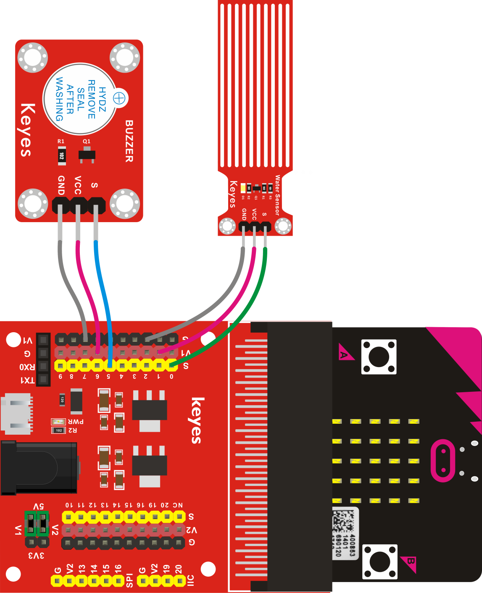

测试代码

测试结果

按照接线图接好线，上传代码，上电，读取到信号端数据，紫外线含量越高，数据越大。我们有两种方法看到测试数据，一是直接在micro：bit主板上LED点阵上看到，，二是利用CoolTerm软件看到显示结果。

打开CoolTerm，点击Options，选择SerialPort，设置COM口和波特率，波特率设置为115200（经过测试，micro:bit V2主板的USB串口通讯波特率默认是115200），点击OK后，最后点击Connect。CoolTerm串口监视器显测试结果，如下图：

## 实验42 测试紫外线

实验说明

前面课程中，我们用光敏电阻传感器检测环境中光照。这一课程中我们主要用keyes GUVA-S12SD 3528 紫外线传感器测试光线中的紫外线。

它是一款测试紫外线的传感器，它包含GUVA-S12SD，可以广泛用于智能穿戴设备的紫外线指数检测，如带UV指数检测功能的手表，带UV指数检测的智能手机，户外检测UV指数设备等，还可以用于紫外线消毒时，用来监测紫外线强度、UV火焰探测器等。

在这实验中，我们将keyes GUVA-S12SD 3528
紫外线传感器信号端接到micro：bit主板的P0，通过读取P0端的模拟值，检测光线中紫外线。我们将所测的模拟值在micro：bit主板上LED点阵或串口监视器上显示。

实验器材

micro：bit主板\*1

keyes micro bit 传感器V2扩展板\*1

USB线\*1

keyes GUVA-S12SD 3528 紫外线传感器\*1

杜邦线若干

接线图

测试代码

测试结果

按照接线图接好线，上传代码，上电，读取到信号端数据，紫外线含量越高，数据越大。我们有两种方法看到测试数据，一是直接在micro：bit主板上LED点阵上看到，，二是利用CoolTerm软件看到显示结果。

打开CoolTerm，点击Options，选择SerialPort，设置COM口和波特率，波特率设置为115200（经过测试，micro:bit V2主板的USB串口通讯波特率默认是115200），点击OK后，最后点击Connect。CoolTerm串口监视器显测试结果，如下图：

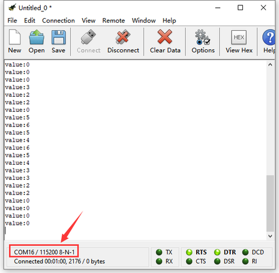

## 实验43 空气中的水汽

实验说明

我们的生活被空气包含，空气中包含很多成分，有些是有用的，有些是有害的，有些成分对人体影响重大，有些成分对人体影响轻微。这个课程中我们用keyes
水滴水蒸气传感器来模拟检测空气中的水蒸气含量。当keyes
水滴水蒸气传感器表面的湿度上升，传感器信号端输出电压将增大。

在这实验中，我们将keyes
水滴水蒸气传感器信号端接到micro：bit主板的P0，通过读取P0端的模拟值，检测空气中水蒸气。我们将所测的模拟值在micro：bit主板上LED点阵或串口监视器上显示。

实验器材

micro：bit主板\*1

keyes micro bit 传感器V2扩展板\*1

USB线\*1

keyes 水滴水蒸气传感器\*1

杜邦线若干

接线图

测试代码

测试结果

按照接线图接好线，上传代码，上电，读取到信号端数据，空气中水蒸气含量越高，数据越大。我们有两种方法看到测试数据，一是直接在micro：bit主板上LED点阵上看到，，二是利用CoolTerm软件看到显示结果。

打开CoolTerm，点击Options，选择SerialPort，设置COM口和波特率，波特率设置为115200（经过测试，micro:bit V2主板的USB串口通讯波特率默认是115200），点击OK后，最后点击Connect。CoolTerm串口监视器显测试结果，如下图：

## 实验44 检测压力

实验说明

前面课程中，我们用不同传感器检测了外界的各种信息，如温度、其他、光线、声音等等。这一课程中我们用Keyes
薄膜压力传感器来检测外界的压力。

它是基于新型纳米压敏材料辅以舒适杨式模量的超薄薄膜衬底一次性贴片而成，兼具防水和压敏双重功能。当传感器感知到外界压力时，传感器电阻值发生变化，然后我们通过电路把电阻变化转换测电压变化，然后在信号端输出。

在这实验中，我们将Keyes
薄膜压力传感器信号端接到micro：bit主板的P0，通过读取P0端的模拟值，模拟检测压力数值。我们将所测的模拟值在micro：bit主板上LED点阵或串口监视器上显示。

实验器材

micro：bit主板\*1

keyes micro bit 传感器V2扩展板\*1

USB线\*1

Keyes 薄膜压力传感器\*1

杜邦线若干

接线图

测试代码

测试结果

按照接线图接好线，上传代码，上电，读取到信号端数据，压力越大，数据越大。我们有两种方法看到测试数据，一是直接在micro：bit主板上LED点阵上看到，，二是利用CoolTerm软件看到显示结果。

打开CoolTerm，点击Options，选择SerialPort，设置COM口和波特率，波特率设置为115200（经过测试，micro:bit V2主板的USB串口通讯波特率默认是115200），点击OK后，最后点击Connect。CoolTerm串口监视器显测试结果，如下图：

## 实验45 震动控灯

实验说明

这一课程中我们主要用到keyes
震动模块传感器，它是用来检测环境中的震动情况的传感器。keyes
震动模块传感器具有无方向性特性，任何角度均可以触发工作，完全密封式封装可以防水、防尘，适用于小电流电路的触发。

这个传感器接上电源后，在静止时为开路（OFF）状态，信号端输出为高电平，传感器上LED变暗；当受到外力碰触而达到适当震动力时，或移动速度达到适当离（偏）心力时，导电接脚会发生瞬间导通（ON）状态，使电气特性改变，信号端输出为低电平，传感器上LED变亮；而当外力消失时电气特性恢复开路（OFF）状态。

在这实验中，我们将keyes
震动模块传感器信号端接到micro：bit主板的P0，通过读取P0端的高低电平变化，控制一个LED模块上LED的亮灭。

实验器材

micro：bit主板\*1

keyes micro bit 传感器V2扩展板\*1

USB线\*1

keyes 震动模块传感器\*1

keyes 食人鱼LED白光模块\*1

杜邦线若干

接线图

测试代码

测试结果

按照接线图接好线，上传代码，上电，当keyes
震动模块传感器检测到震动信号时，keyes
食人鱼LED白光模块上LED亮起，否则熄灭。

## 实验46 摇杆模块的使用

实验说明

当我们在做DIY自己物品时，经常需要用到摇杆模块，如游戏手柄。那摇杆模块模块是怎么样工作的呢？

实际上摇杆模块有3个信号端接口，模拟3维空间，其中信号端X、Y模拟空间的X轴和Y轴，接单片机的模拟输入端口，通过控制2个模拟输入值，控制物体在空间X、Y轴的坐标；Z信号端B模拟空间Z轴，它一般接数字口，做按键使用。

在这实验中，我们将keyes 摇杆模块传感器的X Y信号端接到micro：bit主板的P0 P1，B信号端接到micro：bit主板的P2。我们将所测的数值在串口监视器上显示。

实验器材

micro：bit主板\*1

keyes micro bit 传感器V2扩展板\*1

USB线\*1

keyes 摇杆模块传感器\*1

杜邦线若干

接线图

测试代码

测试结果

按照上图接好线，上传好代码，micro USB线上电后。打开CoolTerm，点击Options，选择SerialPort，设置COM口和波特率，波特率设置为115200（经过测试，micro:bit V2主板的USB串口通讯波特率默认是115200），点击OK后，最后点击Connect。CoolTerm串口监视器显测试结果，如下图：

## 实验47 舵机的使用

实验说明

当我们在做DIY自己小车时，我们会经常让小车实现个自动避障的功能。在DIY过程中我们需要一个舵机控制超声波模块左右转动，然后检测小车与左右两方障碍物的距离，方便控制小车避障。

当我们在利用其它单片机控制舵机转动时，我们通过设置一定频率、一定宽度的脉冲来控制舵机角度。在利用micro bit主板控制舵机角度时，我们只需要在开发环境中设置控制角度就行了，开发环境中会自动设置对应脉冲，用于控制舵机转动。

在这实验中，我们控制SG90舵机转动，它的最大转动角度为90°，我们控制舵机在0°和90°之间来回转动。

实验器材

micro：bit主板\*1

keyes micro bit 传感器V2扩展板\*1

USB线\*1

SG90舵机\*1

接线图

测试代码

测试结果

按照接线图接好线，上传代码，上电后，我们就可以看到舵机在0°到90°之间来回转动。

## 实验48 添加一个显示器

实验说明

在生活中，我们可以用显示屏和其他传感器做各种各样的实验，可以DIY各种各样的小物品，如利用温度模块和显示屏可以做一个温度测试仪，利用超声波模块和显示屏可以做一个距离测试仪。

在这里，我们利用一个1602 I2C LCD当做显示屏，它是1602 LCD，可以显示两行，每行16个字符，它利用I2C通信方式。

在这实验中，我们将1602 I2C LCD接到扩展板上I2C通信接口。micro：bit主板I2C通信接口可以参照micro:bit
引脚说明，其中SDA接口为P20，SCL接口为P19。课程中我们让显示屏上第一行显示“Keyes”字符，第二行显示数字，每过1秒，数字加1。

实验器材

micro：bit主板\*1

keyes micro bit 传感器V2扩展板\*1

USB线\*1

1602 I2C LCD\*1

杜邦线若干

接线图

测试代码

利用库文件设置代码

在下图模块搜索https://github.com/xuefengedu/pxt-lcd1602_CNsonar

点击下图自动下载库文件了，然后在编辑代码栏目里看到对应模块。

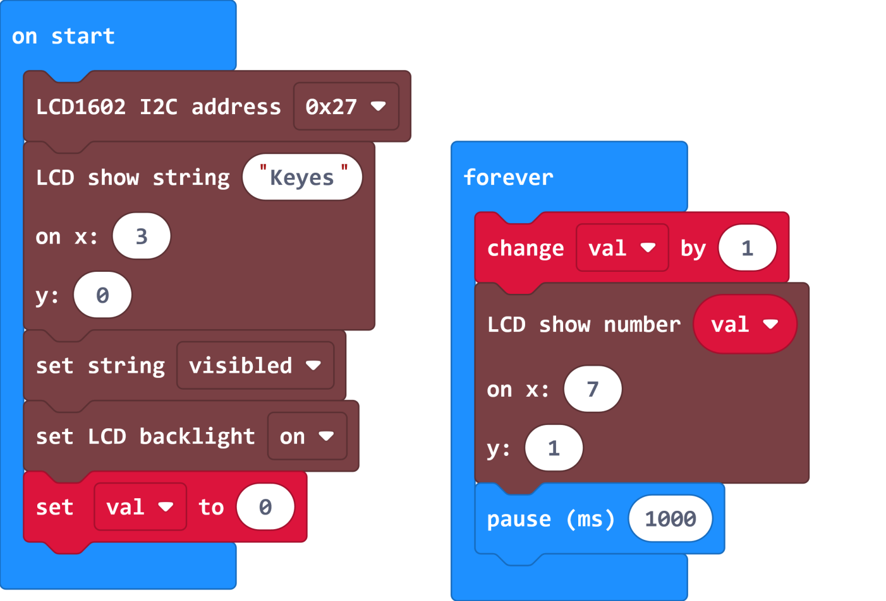

库文件链接为：<https://github.com/xuefengedu/pxt-lcd1602_CN>

测试结果

按照接线图接好线，上传好代码，上电后，显示屏上第一行显示“Keyes”字符，第二行显示数字，每过1秒，数字加1。

注意：按照接线图接好线，上传好代码，上电后，显示屏没有字符显示时，可以调节

LCD后面的电位器，调节背光，使LCD显示对应字符。

## 实验49 DHT11温湿度测试

实验说明

前面课程中我们介绍了1602 I2C LCD，介绍中说明我们可以将LCD和一些传感器搭配使用，组成一个完整的测试仪。这一课程中，我们将LCD和keyes DHT11温湿度传感器搭配，做一个温湿度测试仪。我们利用keyes DHT11温湿度传感器测试当前环境中的温湿度，并将结果在LCD上显示出来。

keyes DHT11温湿度传感器是一款含有已校准数字信号输出的温湿度复合传感器，它应用专用的数字模块采集技术和温湿度传感技术，确保产品具有极高的可靠性和卓越的长期稳定性。

实验器材

micro：bit主板\*1

keyes micro bit 传感器V2扩展板\*1

USB线\*1

1602 I2C LCD\*1

keyes DHT11温湿度传感器\*1

杜邦线若干

接线图

测试代码

利用库文件设置代码

在下图模块搜索DHT11

点击下图自动下载库文件了，然后在编辑代码栏目里看到对应模块。

测试结果

按照接线图接好线，上传好代码，上电后，我们就可以在1602 I2C LCD上看到当前环境中的温湿度数值了。

注意：按照接线图接好线，上传好代码，上电后，显示屏没有字符显示时，可以调节

LCD后面的电位器，调节背光，使LCD显示对应字符。

# 资源链接

<https://makecode.microbit.org/>

<https://tech.microbit.org/hardware/>

<https://microbit.org/new-microbit/>

<https://www.microbit.org/get-started/user-guide/overview/>

<https://microbit.org/get-started/user-guide/features-in-depth/>

<https://tech.microbit.org/hardware/edgeconnector/>

<https://microbit.org/guide/hardware/pins/>

<https://microbit.org/guide/quick/>

<https://microbit.org/get-started/user-guide/mobile/>

<https://microbit.org/code/>

<https://microbit.org/projects/>
