# 产品清单

|编码|规格型号|数量|图片|
|-|-|-|-|
|1|keyes micro bit 传感器V2扩展板|1|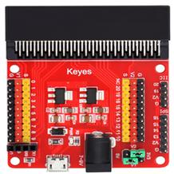|
|2|Keyes 薄膜压力传感器|1|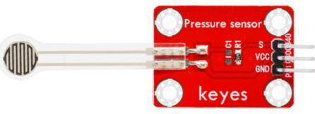|
|3|keyes 巡线传感器|1|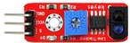|
|4|keyes 震动模块传感器|1|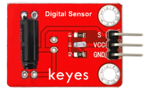|
|5|keyes 水滴水蒸气传感器|1|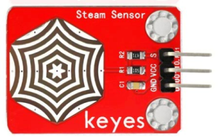|
|6|keyes TEMT6000光线传感器|1|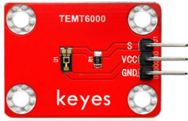|
|7|keyes 光敏电阻传感器|1|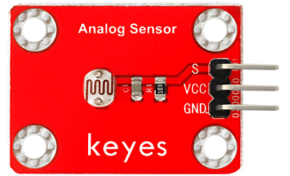|
|8|keyes 麦克风声音传感器|1|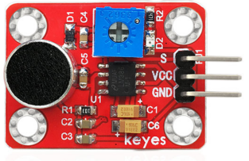|
|9|keyes 有源蜂鸣器模块|1|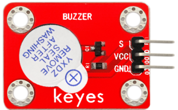|
|10|keyes GUVA-S12SD 3528 紫外线传感器|1|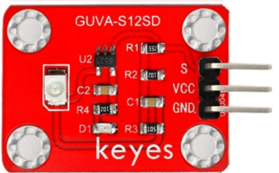|
|11|keyes 无源蜂鸣器模块|1|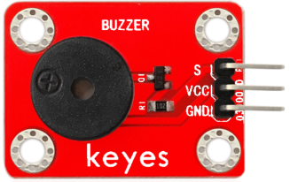|
|12|keyes 插件RGB模块|1|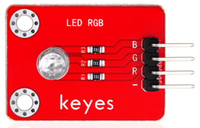|
|13|keyes 霍尔传感器|1|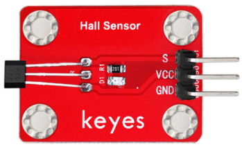|
|14|keyes 电容触摸传感器|1|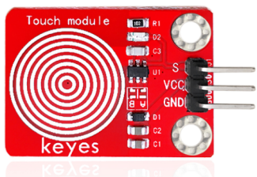|
|15|keyes MQ-2 烟雾传感器|1|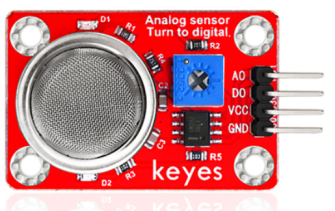|
|16|keyes 水位传感器|1|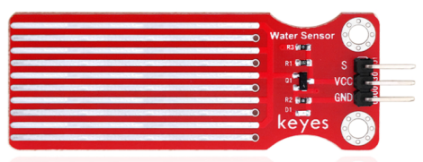|
|17|keyes LM35温度传感器|1|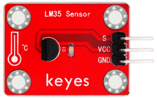|
|18|keyes 食人鱼LED白光模块|1|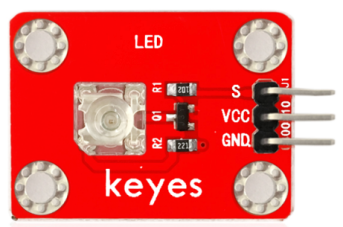|
|19|Keyes 红绿灯模块|1|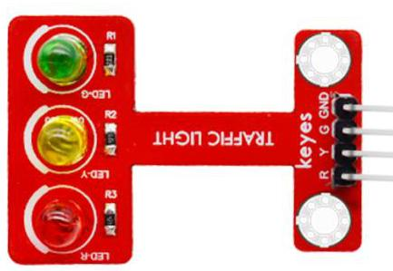|
|20|keyes 干簧管模块|1|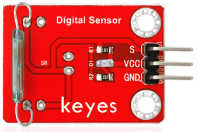|
|21|keyes 土壤传感器|1|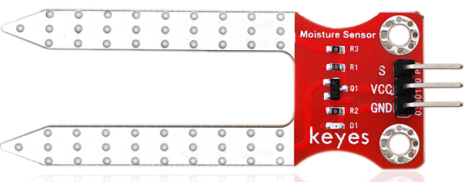|
|22|keyes 光折断传感器|1|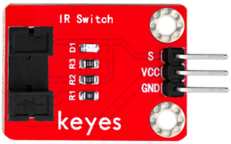|
|23|keyes 碰撞传感器|1|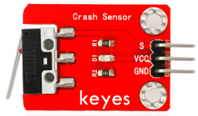|
|24|keyes 避障传感器|1|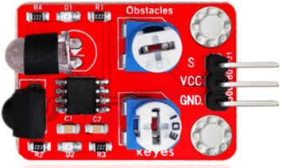|
|25|keyes 草帽LED白发白模块|1|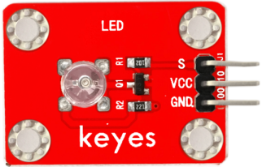|
|26|keyes 3W LED模块|1|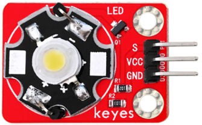|
|27|keyes DHT11温湿度传感器|1|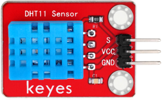|
|28|keyes 摇杆模块传感器|1|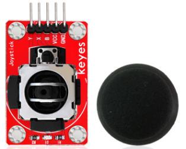|
|29|keyes MQ-3 酒精传感器|1|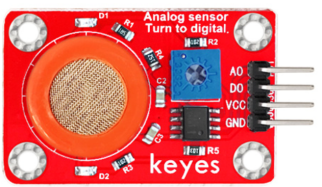|
|30|keyes 倾斜模块传感器|1|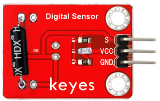|
|31|keyes 5V 单路继电器模块|1|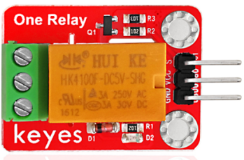|
|32|keyes 火焰传感器|1|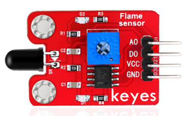|
|33|keyes 按键传感器|1|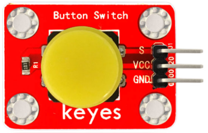|
|34|keyes 人体红外热释电传感器|1|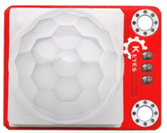|
|35|keyes 可调电位器模块|1|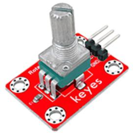|
|36|HC-SR04超声波模块|1|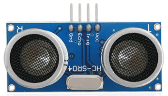|
|37|1602 I2C 蓝屏 LCD|1|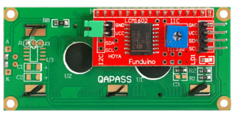|
|38|SG90 9G 23*12.2*29mm 蓝色 辉盛 90度 舵机|1|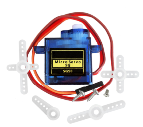|
|39|母对母 杜邦线20CM/40P/2.54/10股铜包铝 24号线|1|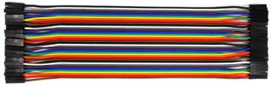|
